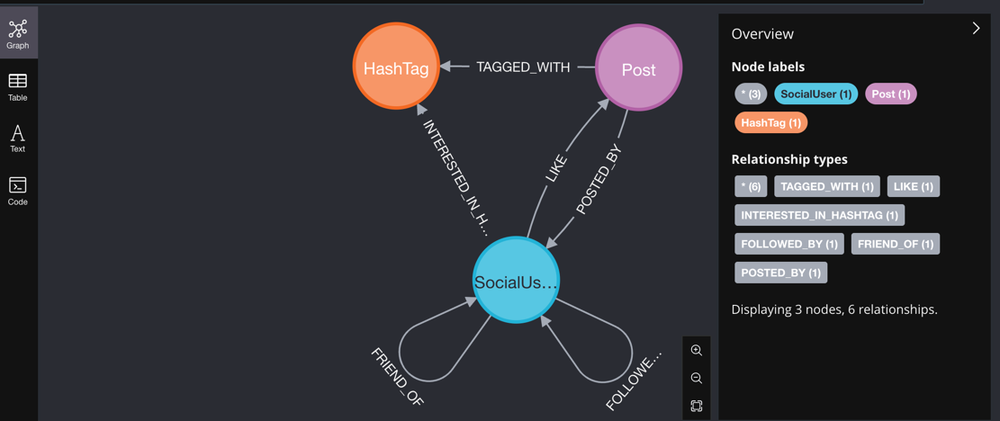

# Neo4j 数据表关系图（Mermaid）

## Description
- **SocialUser**: User node, contains basic user information.
- **Post**: Post node, contains content, image, time, etc.
- **HashTag**: Topic tag node.
- **FRIEND_OF**: Friendship relationship between users.
- **FOLLOWED_BY**: Follow relationship between users.
- **POSTED_BY**: Which user posted the post.
- **LIKE**: Which posts are liked by users.
- **TAGGED_WITH**: Which tags are included in the post.
- **INTERESTED_IN_HASHTAG**: Which tags users are interested in.

